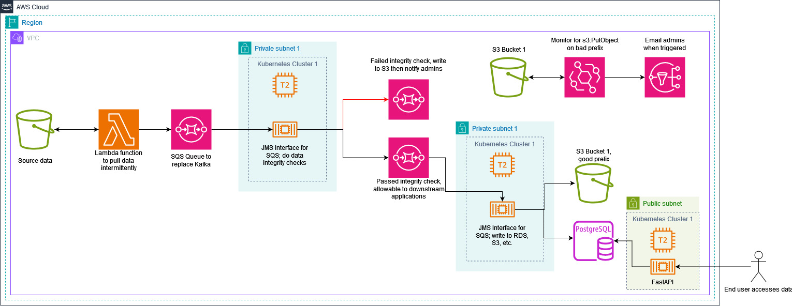
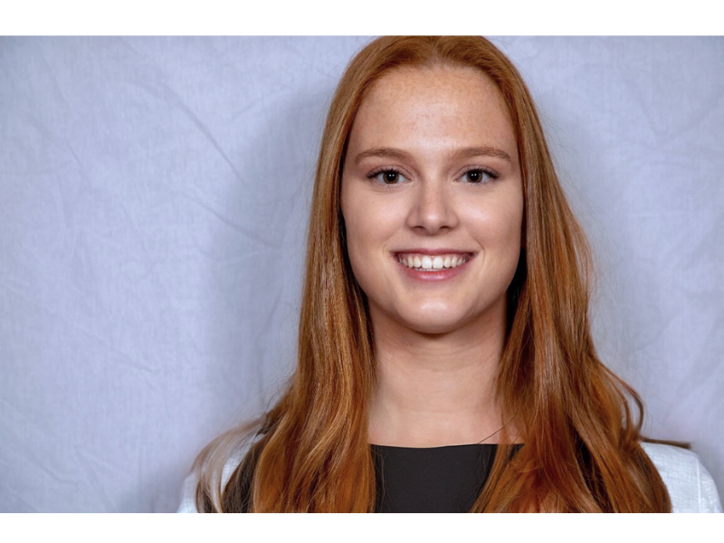

<h1>Project Purpose</h1>

The purpose of this project is to simulate the processing of streaming financial transactional data in real-time. The team is leveraging Amazon Web Services (AWS) Free Tier to build a data pipeline that validates, processes, and serves the streaming data via an API. The services that are being used are AWS Lambda, Amazon Simple Storage Service (S3), FastAPI, Amazon EventBridge, Amazon Relational Database Service (RDS) for PostgreSQL, and Kubernetes deployed to an Amazon Elastic Compute Cloud (EC2) virtual machine instance.

<h1>Month 1 Overview</h1>

Month 1 was dedicated to design of the AWS infrastructure and technologies that will be used to bring this project to life. The team worked back and forth with our sponsor to refine the design to something that conforms to the AWS Free Tier, while also accomplishing our goal. We ended up deciding on the design below this description. There were a total of four designs that we ended up not using after extensive research and began to plan ahead for month two development.

<h1>Month 2 Overview</h1>

Month 2 was entirely dedicated to development of the design that was realized in month 1. We were able to develop a Lambda function to pull and forward data, stood up an RDS for PostgreSQL database to hold our verified data, and deployed two EC2 instances to run a Kubernetes cluster that will do our data integrity verification and validation. We also developed the applications in Java that will be doing the integrity verification and validation. Take a look at a <a href="https://youtu.be/nTz7m1ExWQE">preliminary demo of the project</a>, which shows going from AWS S3 to our database and the processing in between!

 
<iframe>
src="https://youtu.be/nTz7m1ExWQE">
</iframe>
 

# Team Members

**Christopher Bussen**

Chris is a senior Computer Science student with minors in Mathematics and Data Analytics at the University of Dayton graduating in May of 2024. He plans to pursue a job in data science/analytics and machine learning after graduation. Please connect with him on LinkedIn <a href="https://www.linkedin.com/in/christopherbussen/">here.</a>

**Josephine Juhring**

Josie is a senior Computer Information Systems student graduating in May 2024. She has concentrations in Cyber Defense and Software Engineering. She currently works part-time as a Scrum Master for Riverside Research, and will transition to full-time after graduation. Please connect with her on LinkedIn <a href="https://www.linkedin.com/in/josiejuhring/">here.</a>

**Jack McNulty**

Jack is a senior Computer Science student at the University of Dayton graduating in May of 2024. He is currently a software developer for a government contracting agency. He plans to pursue a job in software development and cloud engineering after graduation. Please connect with him on LinkedIn <a href="https://www.linkedin.com/in/jack-mcnulty-6767a9186/">here.</a>

**Harshita M.P.**

Harshita is a senior Computer Science student at the University of Dayton with a concentration in Cyber Defense graduating in December of 2024. Her academic focus aligns with her interests in cyber defense, RPA, and AI. Harshita aims to continue her education by pursuing a Master's degree in Computer Science/Cybersecurity. Please connect with her on LinkedIn <a href="https://www.linkedin.com/in/harshita-m-p-13b656203/">here.</a> 

**Duncan Ulman**

Duncan is a senior Computer Science student at the University of Dayton graduating in May of 2024. He will begin work with Dell Technologies in Boston, Massachusetts after graduation. Please connect with him on LinkedIn <a href="https://www.linkedin.com/in/duncan-ulman-0b3133200/">here.</a>
